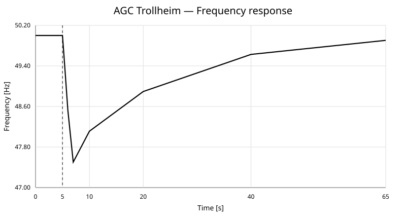
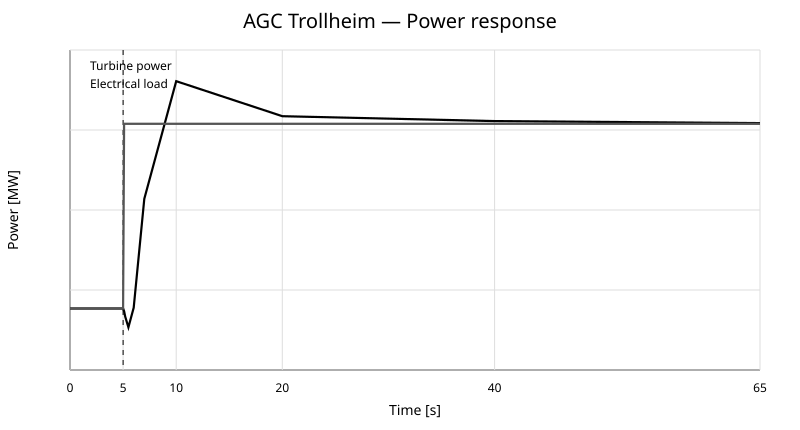
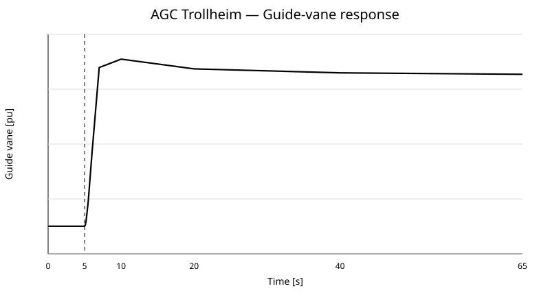
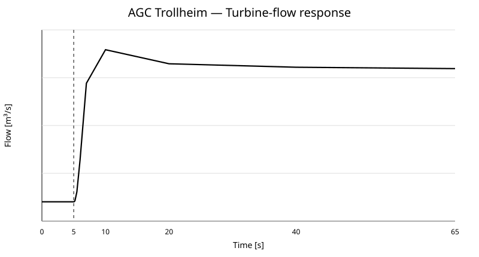

# AGC_Trollheim — OpenHPL active-power/frequency-control benchmark

## 1. Purpose

`OpenHPL.Examples.AGC_Trollheim.TrollheimAGC` is a nonlinear hydropower load-frequency-control benchmark assembled from OpenHPL components. It represents a **Trollheim-inspired 150 MW plant model** and applies a 10% system-base active-power load increase from 50% to 60% loading at `t = 5 s`.

The plant rating and hydraulic geometry are transferred from the existing Trollheim benchmark used in `HydroSyncBridge.jl`. They are **benchmark parameters, not independently field-verified Trollheim HPP data**.

$$
P_b=150\;\mathrm{MW},\qquad f_0=50\;\mathrm{Hz},\qquad 0\le t\le65\;\mathrm{s}.
$$

The load disturbance is

$$
P_L(t)=
\begin{cases}
0.50P_b=75\;\mathrm{MW}, & t<5\;\mathrm{s},\\[4pt]
0.60P_b=90\;\mathrm{MW}, & t\ge5\;\mathrm{s}.
\end{cases}
$$

## 2. Folder layout

```text
OpenHPL/Examples/AGC_Trollheim/
├── package.mo
├── package.order
├── TrollheimAGC.mo
├── README.md
└── plots/
    ├── frequency_response.svg
    ├── power_response.svg
    ├── gate_response.svg
    └── flow_response.svg
```

## 3. Validated v1 architecture

```text
Upper reservoir
      |
      v
  Intake pipe
      |
      v
    Penstock
      |
      v
 Simple turbine ---- mechanical shaft ---- SimpleGen ---- Grid/load
      |
      v
 Discharge pipe
      |
      v
 Tail reservoir

 generator.f
      |
      v
 SimpleGovernorAGC
      |
      +----------------------------> turbine.u_t
```

Hydraulic path:

$$
\text{Reservoir}\rightarrow\text{Intake}\rightarrow\text{Penstock}
\rightarrow\text{Turbine}\rightarrow\text{Discharge}\rightarrow\text{Tailrace}.
$$

Electromechanical/control path:

$$
P_m\rightarrow\text{shaft/generator}\rightarrow f
\rightarrow\text{Governor+AGC}\rightarrow u_g\rightarrow P_m.
$$

A first higher-fidelity version also included `OpenHPL.Waterway.SurgeTank`. Its structural model was balanced, but OpenModelica could not robustly solve the coupled surge-flow/manifold initialization at `t=0`. The validated v1 benchmark therefore omits the surge tank rather than hiding an unresolved initialization problem.

## 4. Existing OpenHPL models reused

| Role | Existing model | Function |
|---|---|---|
| Upper hydraulic boundary | `OpenHPL.Waterway.Reservoir` | Constant-head/elevation source |
| Intake | `OpenHPL.Waterway.Pipe` | Water-column inertia and Darcy friction |
| Penstock | `OpenHPL.Waterway.Pipe` | Nonlinear pressure/flow dynamics |
| Turbine | `OpenHPL.ElectroMech.Turbines.Turbine` | Gate-dependent flow and hydraulic-to-shaft power |
| Generator | `OpenHPL.ElectroMech.Generators.SimpleGen` | Rotor inertia and electrical loading |
| Grid/load equivalent | `OpenHPL.ElectroMech.PowerSystem.Grid` | Electrical load torque and common shaft frequency |
| Tail hydraulic boundary | `OpenHPL.Waterway.Reservoir` | Tailwater boundary |
| Disturbance | `Modelica.Blocks.Sources.Step` | 75 MW to 90 MW at 5 s |

## 5. New controller model

The reusable controller is

```text
OpenHPL/ElectroMech/PowerSystem/SimpleGovernorAGC.mo
```

It contains permanent droop, integral secondary control, gate saturation, and a first-order guide-vane servo.

The controller equations are

$$
e_f=f_{ref}-f_{pu},
$$

$$
\dot{x}_i=e_f,
$$

$$
u_{cmd}=u_{bias}+\frac{e_f}{R}+K_i x_i,
$$

$$
u_{sat}=\operatorname{clip}(u_{cmd},u_{min},u_{max}),
$$

$$
T_g\dot u=u_{sat}-u,
$$

$$
g=u.
$$

The verified Trollheim controller parameters are

$$
\boxed{R=0.50},\qquad
\boxed{T_g=0.30\;\mathrm{s}},\qquad
\boxed{K_i=0.10\;\mathrm{s}^{-1}}.
$$

The large droop is deliberate. The transferred rotor inertia and long waterways create strong hydro inverse-response dynamics, so the aggressive small-system controller gains used in `AGC_SMIB` are not stable when copied directly to this 150 MW case.

## 6. Connectors and causality

### Hydraulic connectors

At each hydraulic connection, pressure compatibility and mass-flow continuity are enforced:

$$
p_a=p_b,
$$

$$
\dot m_a+\dot m_b=0.
$$

The waterway therefore behaves as one coupled nonlinear DAE.

### Mechanical shaft

The turbine, generator, and grid share a rotational flange:

$$
\omega_t=\omega_g=\omega_{grid},
$$

$$
\tau_t+\tau_g+\tau_{grid}=0.
$$

### Causal signal connections

```text
generator.f    -> governor.f_pu
governor.gate  -> turbine.u_t
loadStep.y     -> grid.Pload
```

The hydraulic and mechanical connections are acausal physical connections, while the controller is causal signal flow.

## 7. Core physical equations

### Waterway momentum

The conduit model represents water-column momentum with nonlinear friction. In compact form,

$$
\frac{dM}{dt}=F_p+F_g-F_f+F_{conv},
$$

with Darcy-Weisbach friction approximately

$$
F_f\propto f_D L\rho Dv|v|.
$$

Water flow cannot change instantaneously, so guide-vane motion does not produce instantaneous mechanical power.

### Turbine

The turbine shaft power is

$$
P_m=\eta_h\,\Delta p_t\,\dot V_t,
$$

with

$$
\eta_h=0.90.
$$

### Rotor dynamics

The rotor mechanical-energy balance is

$$
J\omega\dot\omega=P_m-P_e-P_{loss}.
$$

Around nominal frequency this is analogous to

$$
2H\dot{\Delta f}_{pu}=\Delta P_m-\Delta P_e-D\Delta f_{pu}.
$$

Frequency output is

$$
f=50f_{pu}.
$$

The explicit grid self-regulation terms are disabled in this benchmark:

```text
Lambda = 0
mu     = 0
```

This intentionally exposes rotor inertia, waterway dynamics, and governor/AGC action.

## 8. Parameters

| Parameter | Value | Status |
|---|---:|---|
| Plant base power | 150 MW | transferred benchmark |
| Initial load | 75 MW | 50% loading |
| Final load | 90 MW | 60% loading |
| Load step time | 5 s | experiment |
| Nominal frequency | 50 Hz | Nordic nominal |
| Generator poles | 12 | transferred benchmark |
| Total rotor inertia | `2e5 kg m^2` | transferred benchmark |
| Turbine inertia used | `1e5 kg m^2` | half of total |
| Generator inertia used | `1e5 kg m^2` | half of total |
| Intake elevation drop | 20 m | transferred benchmark |
| Intake length | 500 m | transferred benchmark |
| Intake diameter | 6 m | transferred benchmark |
| Penstock elevation drop | 300 m | transferred benchmark |
| Penstock length | 500 m | transferred benchmark |
| Penstock diameter | 4 m | transferred benchmark |
| Discharge elevation drop | 2 m | transferred benchmark |
| Discharge length | 600 m | transferred benchmark |
| Discharge diameter | 6 m | transferred benchmark |
| Turbine nominal head | 340 m | benchmark engineering value |
| Turbine nominal flow | 50 m3/s | benchmark engineering value |
| Hydraulic efficiency | 0.90 | benchmark assumption |
| Initial flow guess | 25 m3/s | operating-point guess |
| Droop `R` | 0.50 | nonlinear tuning result |
| Servo time `T_g` | 0.30 s | controller benchmark |
| Integral gain `K_i` | 0.10 1/s | nonlinear tuning result |
| Gate limits | 0.05–1.00 pu | controller constraint |

Nominal hydraulic consistency:

$$
P_m\approx\eta\rho gHQ
$$

$$
\approx0.90\times1000\times9.81\times340\times50
\approx150\;\mathrm{MW}.
$$

The solved 50% operating point has approximately

$$
\dot V_t(0)=23.1783\;\mathrm{m^3/s}.
$$

## 9. Initial conditions

The target pre-disturbance equilibrium is

$$
f(0)=50\;\mathrm{Hz},
$$

$$
P_m(0)=P_e(0)=75\;\mathrm{MW},
$$

$$
\dot\omega(0)=0.
$$

The model uses steady-state hydraulic initialization and explicitly imposes

```modelica
initial equation
  der(generator.inertia.w)=0;
```

Fixing the initial speed alone is not sufficient; the initial shaft torque balance must also yield zero acceleration.

The controller is initialized with steady states satisfying approximately

$$
\dot x_i(0)=0,
$$

$$
\dot u(0)=0.
$$

### Verified pre-step state

| Quantity | `t=0 s` | `t=4.9 s` |
|---|---:|---:|
| Frequency | 50.000000 Hz | 49.999832 Hz |
| Turbine power | 75.000000 MW | 74.999564 MW |
| Electrical load | 75.000000 MW | 75.000000 MW |
| Guide vane | 0.446340 pu | 0.446347 pu |
| Flow | 23.178261 m3/s | 23.178451 m3/s |

Across the complete 0–5 s interval,

$$
\max(f)-\min(f)=1.71\times10^{-4}\;\mathrm{Hz},
$$

$$
\max(P_m)-\min(P_m)=5.02\times10^{-4}\;\mathrm{MW}.
$$

This verifies a practically stationary initial condition.

## 10. Load-step response

At 5 s,

$$
\Delta P_L=15\;\mathrm{MW}=0.10\;pu.
$$

Immediately after the step,

$$
P_m<P_e,
$$

hence

$$
\dot\omega<0.
$$

Frequency drops, the governor opens the gate, flow increases, and turbine power recovers. The first few tenths of a second show the expected hydro inverse response: gate position increases before mechanical power fully responds.

| Time [s] | Frequency [Hz] | Turbine power [MW] | Load [MW] | Gate [pu] | Flow [m3/s] |
|---:|---:|---:|---:|---:|---:|
| 5.00 | 49.999829 | 74.999570 | 75 | 0.446347 | 23.178459 |
| 5.10 | 49.862109 | 74.774325 | 90 | 0.447170 | 23.183691 |
| 5.20 | 49.720748 | 74.339199 | 90 | 0.449350 | 23.213759 |
| 5.50 | 49.273102 | 73.471254 | 90 | 0.461169 | 23.526786 |
| 6.00 | 48.526262 | 75.065923 | 90 | 0.489047 | 24.641352 |
| 7.00 | 47.503292 | 83.909308 | 90 | 0.540325 | 27.331062 |
| 10.00 | 48.111616 | 93.467307 | 90 | 0.545280 | 28.504703 |
| 20.00 | 48.895138 | 90.620646 | 90 | 0.539511 | 28.012977 |
| 40.00 | 49.627165 | 90.220357 | 90 | 0.537179 | 27.891007 |
| 65.00 | 49.903676 | 90.056713 | 90 | 0.536310 | 27.844067 |

Frequency nadir:

$$
\boxed{f_{nadir}=47.30558\;\mathrm{Hz}}
$$

at

$$
\boxed{t_{nadir}=7.70\;\mathrm{s}}.
$$

Final values at 65 s:

$$
\boxed{f(65)=49.90368\;\mathrm{Hz}},
$$

$$
\boxed{P_m(65)=90.05671\;\mathrm{MW}},
$$

$$
\boxed{u_g(65)=0.53631},
$$

$$
\boxed{\dot V_t(65)=27.84407\;\mathrm{m^3/s}}.
$$

The 47.3 Hz nadir is **not a prediction of real Trollheim system frequency**. This isolated benchmark does not contain the full Nordic synchronous-area inertia or distributed frequency response.

## 11. Verification plots

### Frequency response



### Mechanical power and load



### Guide-vane response



### Turbine-flow response



## 12. Governor tuning trail

Copying the aggressive `AGC_SMIB` tuning directly to this model was not stable.

Approximate transferred inertia constant:

$$
H\approx\frac{\tfrac12J\omega_m^2}{P_b}\approx1.83\;\mathrm{s}.
$$

An approximate water starting time for the transferred waterway is

$$
T_w\approx0.55\;\mathrm{s}.
$$

A classical reduced hydro-turbine approximation is

$$
G_h(s)=\frac{1-T_ws}{1+\tfrac12T_ws}.
$$

The right-half-plane zero captures the inverse hydro response and explains why aggressive gate commands can initially reduce mechanical power.

| `R` | `K_i` [1/s] | Nonlinear result |
|---:|---:|---|
| 0.05 | 1.50 | poorly damped; gate saturation; nadir ≈43.25 Hz |
| 0.20 | 0.15 | long-period oscillatory response; rejected |
| 0.50 | 0.05 | stable baseline; `f(65)≈49.50 Hz` |
| **0.50** | **0.10** | **selected v1 tuning; stable; `f(65)=49.904 Hz`** |

These values establish a stable research benchmark; they are not claimed to be an optimal or plant-certified governor design.

## 13. OpenModelica verification

The final model was tested with OpenModelica 1.27.0 and DASSL.

Structural check:

```text
279 equations
279 variables
183 trivial equations
```

Initialization completed successfully using **3 homotopy steps**, and the complete 0–65 s simulation finished successfully.

OpenModelica still issues generic mixed initialization-specification warnings inherited from the component hierarchy (`not fully specified` / `over specified`). They do not prevent convergence in this case but should be cleaned up in future library work.

## 14. Surge-tank forensic result

A higher-fidelity topology was also tested:

```text
Reservoir -> Intake -> SurgeTank -> Penstock -> Turbine
```

It passed structural checking with

```text
314 equations
314 variables
```

but the coupled nonlinear initialization failed at `t=0`. The unresolved loop involves the surge branch and manifold pressure/flow equilibrium. Changing the surge-level seed alone did not make the global initialization robust.

The next solution should use a two-stage warm start:

1. solve or simulate the hydraulic subsystem to equilibrium,
2. extract conduit flow, surge level, gate position, and shaft speed,
3. use these values as consistent initial states/guesses for the AGC disturbance run.

## 15. Validation checklist

| Check | Result |
|---|---|
| Modelica structural check | PASS |
| Equations = variables | PASS, 279 = 279 |
| Nonlinear initialization | PASS |
| Homotopy initialization | PASS, 3 steps |
| 0–5 s steady condition | PASS |
| 75 → 90 MW step at 5 s | PASS |
| Frequency initially declines | PASS |
| Guide vane opens | PASS |
| Turbine flow increases | PASS |
| Turbine power approaches 90 MW | PASS |
| Sustained instability eliminated | PASS |
| Frequency recovery toward 50 Hz | PASS, 49.904 Hz at 65 s |
| Surge-tank variant | OPEN — requires warm start |

## 16. Next development path

The present electrical side is an aggregate electromechanical grid/load model. It does not yet contain the classical SMIB electrical relation

$$
P_e=\frac{EV}{X}\sin\delta.
$$

Recommended path:

```text
TrollheimAGC v1
      |
      +--> warm-started surge-tank model
      |
      +--> transient-droop / lead-lag hydro governor
      |
      +--> detailed synchronous generator
      |
      +--> infinite bus / OpenIPSL network
      |
      +--> ACE + tie-line AGC
      |
      +--> Nordic multi-machine study
```

This v1 model should remain as the simple nonlinear reference case while hydraulic and electrical fidelity are increased.
