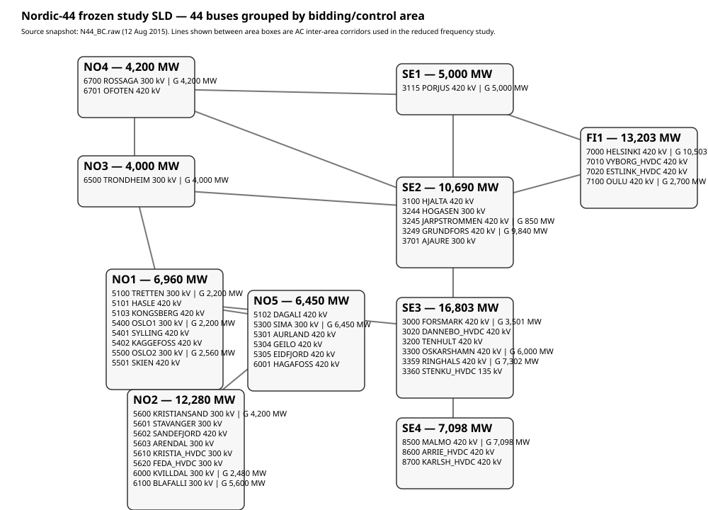
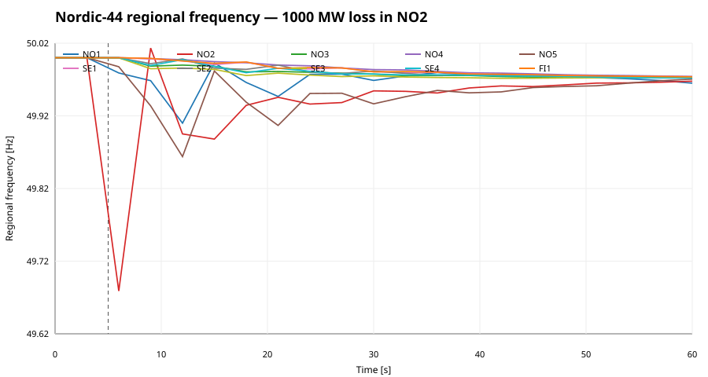
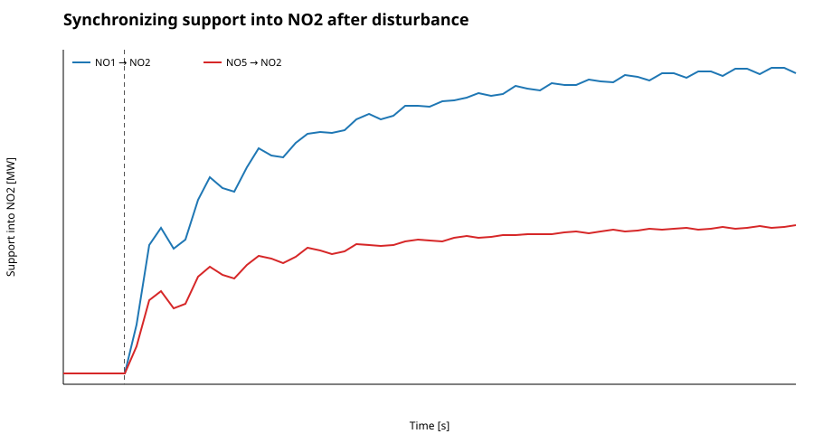

# Nordic-44 frozen SLD and multi-area frequency disturbance study

This note freezes a reproducible Nordic-44 study case inside the `Two_Synchronous_Area` branch and extends the earlier 5+3 hydro example to the Nordic equivalent network.

## 1. Frozen source

**Static/network snapshot:** `ALSETLab/Nordic44-Nordpool/nordic44/models/N44_BC.raw`  
**Dynamic model companion:** `N44_BC.dyr`  
**RAW case date:** **2015-08-12**  
**System base:** **1000 MVA**, **50 Hz**

The ALSETLab dataset is the historical PSS/E Nordic-44 model used with Nord Pool-matched 2015 operating snapshots. The newer Statnett Nordic44 repository is CIM-based. This study deliberately freezes the historical RAW/DYR pair because it exposes buses, generator records, AC branch reactances and dynamic machine/governor data in a directly reproducible form.

> Important: the frequency results below are from an **API-derived reduced 10-area swing/governor model**, not a claim that the complete PSS/E DYR model has been time-domain simulated here.

## 2. Frozen single-line representation



The figure keeps all **44 buses** and groups them by the ten Nordic bidding/control areas present in the RAW file. Inter-area AC corridors are drawn between area boxes. HVDC terminal buses remain listed but are not treated as synchronous AC couplings in the reduced frequency model.

## 3. Area summary

| area | buses | gen units | gen capacity [MW] | base-case Pgen [MW] |
|---|---:|---:|---:|---:|
| NO1 | 8 | 6 | 6,960 | 1,889.0 |
| NO2 | 8 | 13 | 12,280 | 5,809.0 |
| NO3 | 1 | 4 | 4,000 | 805.0 |
| NO4 | 2 | 4 | 4,200 | 2,081.0 |
| NO5 | 6 | 6 | 6,450 | 4,340.0 |
| SE1 | 1 | 5 | 5,000 | 1,582.0 |
| SE2 | 5 | 9 | 10,690 | 3,719.0 |
| SE3 | 6 | 15 | 16,803 | 9,532.0 |
| SE4 | 3 | 6 | 7,098 | 1,016.0 |
| FI1 | 4 | 12 | 13,203 | 7,717.0 |

`gen capacity` is the sum of the PSS/E generator `PT` limits at the bus records. `base-case Pgen` is the summed solved active generation in the frozen case. Total installed generator capability is **86,684 MW**.

## 4. All 44 buses and generator capability

| bus | name | kV | area | gen units | gen capacity [MW] | Pgen [MW] |
|---:|---|---:|---|---:|---:|---:|
| 3000 | FORSMARK | 420 | SE3 | 3 | 3501 | 1113.7 |
| 3020 | DANNEBO_HVDC | 420 | SE3 | 0 | 0 | 0.0 |
| 3100 | HJALTA | 420 | SE2 | 0 | 0 | 0.0 |
| 3115 | PORJUS | 420 | SE1 | 5 | 5000 | 1582.0 |
| 3200 | TENHULT | 420 | SE3 | 0 | 0 | 0.0 |
| 3244 | HOGASEN | 300 | SE2 | 0 | 0 | 0.0 |
| 3245 | JARPSTROMMEN | 420 | SE2 | 1 | 850 | 200.3 |
| 3249 | GRUNDFORS | 420 | SE2 | 8 | 9840 | 3518.7 |
| 3300 | OSKARSHAMN | 420 | SE3 | 6 | 6000 | 4224.6 |
| 3359 | RINGHALS | 420 | SE3 | 6 | 7302 | 4193.7 |
| 3360 | STENKU_HVDC | 135 | SE3 | 0 | 0 | 0.0 |
| 3701 | AJAURE | 300 | SE2 | 0 | 0 | 0.0 |
| 5100 | TRETTEN | 300 | NO1 | 2 | 2200 | 703.5 |
| 5101 | HASLE | 420 | NO1 | 0 | 0 | 0.0 |
| 5102 | DAGALI | 420 | NO5 | 0 | 0 | 0.0 |
| 5103 | KONGSBERG | 420 | NO1 | 0 | 0 | 0.0 |
| 5300 | SIMA | 300 | NO5 | 6 | 6450 | 4340.0 |
| 5301 | AURLAND | 420 | NO5 | 0 | 0 | 0.0 |
| 5304 | GEILO | 420 | NO5 | 0 | 0 | 0.0 |
| 5305 | EIDFJORD | 420 | NO5 | 0 | 0 | 0.0 |
| 5400 | OSLO1 | 300 | NO1 | 2 | 2200 | 666.5 |
| 5401 | SYLLING | 420 | NO1 | 0 | 0 | 0.0 |
| 5402 | KAGGEFOSS | 420 | NO1 | 0 | 0 | 0.0 |
| 5500 | OSLO2 | 300 | NO1 | 2 | 2560 | 519.0 |
| 5501 | SKIEN | 420 | NO1 | 0 | 0 | 0.0 |
| 5600 | KRISTIANSAND | 300 | NO2 | 4 | 4200 | 945.5 |
| 5601 | STAVANGER | 300 | NO2 | 0 | 0 | 0.0 |
| 5602 | SANDEFJORD | 420 | NO2 | 0 | 0 | 0.0 |
| 5603 | ARENDAL | 300 | NO2 | 0 | 0 | 0.0 |
| 5610 | KRISTIA_HVDC | 300 | NO2 | 0 | 0 | 0.0 |
| 5620 | FEDA_HVDC | 300 | NO2 | 0 | 0 | 0.0 |
| 6000 | KVILLDAL | 300 | NO2 | 4 | 2480 | 1719.4 |
| 6001 | HAGAFOSS | 420 | NO5 | 0 | 0 | 0.0 |
| 6100 | BLAFALLI | 300 | NO2 | 5 | 5600 | 3144.1 |
| 6500 | TRONDHEIM | 300 | NO3 | 4 | 4000 | 805.0 |
| 6700 | ROSSAGA | 300 | NO4 | 4 | 4200 | 2081.0 |
| 6701 | OFOTEN | 420 | NO4 | 0 | 0 | 0.0 |
| 7000 | HELSINKI | 420 | FI1 | 9 | 10503 | 6366.9 |
| 7010 | VYBORG_HVDC | 420 | FI1 | 0 | 0 | 0.0 |
| 7020 | ESTLINK_HVDC | 420 | FI1 | 0 | 0 | 0.0 |
| 7100 | OULU | 420 | FI1 | 3 | 2700 | 1350.1 |
| 8500 | MALMO | 420 | SE4 | 6 | 7098 | 1016.0 |
| 8600 | ARRIE_HVDC | 420 | SE4 | 0 | 0 | 0.0 |
| 8700 | KARLSH_HVDC | 420 | SE4 | 0 | 0 | 0.0 |

## 5. Reduced synchronous-region model

The Nordic AC system is one synchronous frequency area, but a disturbance does not appear identically at every location. For analysis we retain ten coherent regional frequency states: NO1, NO2, NO3, NO4, NO5, SE1, SE2, SE3, SE4 and FI1.

```text
d(delta_a)/dt = 2*pi*Delta f_a

M_a d(Delta f_a)/dt =
    Delta Pm_a - Delta PL_a - sum_b Delta P_ab - D_a Delta f_a

Tg_a dPg_a/dt = -Kp_a Delta f_a - Pg_a
Tt_a dPm_a/dt = Pg_a - Pm_a

Delta P_ab = K_ab (delta_a - delta_b)
```

Raw corridor stiffness is estimated from the frozen branch reactances as

```text
K_ab,raw = sum(1000 / X_line) [MW/rad]
K_ab = 0.01 K_ab,raw
```

The `0.01` factor is a documented reduced-model aggregation parameter; it is not a Nordic44 RAW parameter. Primary droop is 5% on regional generator capability. Integration uses a stiff adaptive solver with `max_step = 0.05 s`.

## 6. Disturbance

At `t = 5 s`:

```text
Region: NO2
Disturbance: +1000 MW generation-loss equivalent
Simulation: 0 ... 60 s
```

Research question: **How much does a disturbance in one region depress frequency elsewhere, and how do neighboring regions carry part of the imbalance through AC synchronizing power?**

## 7. Regional frequency response



| area | nadir [Hz] | nadir time [s] | final [Hz] | max drop [Hz] |
|---|---:|---:|---:|---:|
| NO1 | 49.8858 | 7.55 | 49.9650 | 0.1142 |
| NO2 | 49.6434 | 6.40 | 49.9677 | 0.3566 |
| NO3 | 49.9711 | 57.75 | 49.9732 | 0.0289 |
| NO4 | 49.9743 | 59.90 | 49.9743 | 0.0257 |
| NO5 | 49.8573 | 12.25 | 49.9706 | 0.1427 |
| SE1 | 49.9737 | 60.00 | 49.9737 | 0.0263 |
| SE2 | 49.9720 | 59.40 | 49.9728 | 0.0280 |
| SE3 | 49.9685 | 57.85 | 49.9732 | 0.0315 |
| SE4 | 49.9704 | 59.35 | 49.9720 | 0.0296 |
| FI1 | 49.9737 | 60.00 | 49.9737 | 0.0263 |

The largest drop occurs in NO2. NO1 and NO5 have the next largest excursions because they are direct electrical neighbors. More distant Swedish and Finnish regions move less initially, but the effect is nonzero: the disturbance propagates through synchronizing power and common primary response.

A 1000 MW event in NO2 produces approximately **356.6 mHz** local maximum drop, versus **114.2 mHz** in NO1 and **142.7 mHz** in NO5 in this benchmark.

## 8. Who supports NO2?



| neighbor | support at 6 s [MW] | support at 10 s [MW] | peak import [MW] |
|---|---:|---:|---:|
| NO1 | 91.0 | 248.5 | 572.2 |
| NO5 | 50.1 | 129.6 | 274.4 |

Positive power means transient support flowing into NO2. Immediately after the event, rotor-angle separation develops and NO1/NO5 export more electrical power toward NO2. Their governors subsequently increase mechanical input, so support evolves from inertial/synchronizing exchange toward primary frequency response.

```text
local imbalance
  -> local frequency falls
  -> relative rotor angles change
  -> corridor power changes
  -> neighboring areas temporarily carry part of the imbalance
  -> governors across the synchronous system respond
  -> regional frequencies converge toward a common trajectory
```

## 9. Interpretation

Do not mix three quantities:

1. **Generator frequency:** individual synchronous-machine rotor speed.
2. **Regional/coherent frequency:** inertia-weighted motion within an electrical/geographical cluster.
3. **Nordic COI frequency:** inertia-weighted frequency of all synchronous generation.

The Nordic AC grid is one synchronous system, but spatial electromechanical differences remain during disturbances. Assuming all regional frequencies are identical at every instant removes the inter-area modes that this study is intended to expose.

The next full-dynamic formulation should compute

```text
f_COI,Nordic = sum_i(H_i S_i f_i) / sum_i(H_i S_i)
```

from actual `N44_BC.dyr` machine inertias and compare every regional `f_a - f_COI,Nordic`.

## 10. Reproducibility files

```text
Nordic44Study/
├── README.md
├── nordic44_reduced_frequency.py
├── data/
│   ├── nordic44_area_summary.csv
│   ├── nordic44_bus_generation_table.csv
│   ├── nordic44_disturbance_metrics.csv
│   └── nordic44_no2_support.csv
└── results/
    ├── nordic44_frozen_sld.svg
    ├── nordic44_area_frequencies.svg
    └── nordic44_no2_support.svg
```

## 11. Next full-dynamic step

The reduced model explains **why** one region helps another. The next layer is to execute the actual `N44_BC.dyr` synchronous-machine and governor models through a supported dynamic-simulation API, apply the same NO2 event, and plot every generator rotor frequency, regional COIs, Nordic-wide COI, corridor power deviations, `f_region - f_Nordic_COI`, and modal frequency/damping of the dominant inter-area oscillations. That connects Nordic-44 directly to the heterogeneous Trollheim/OpenHPL work in this branch.
