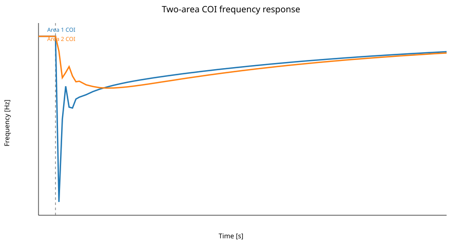
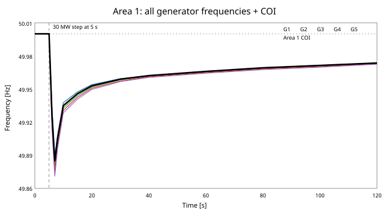
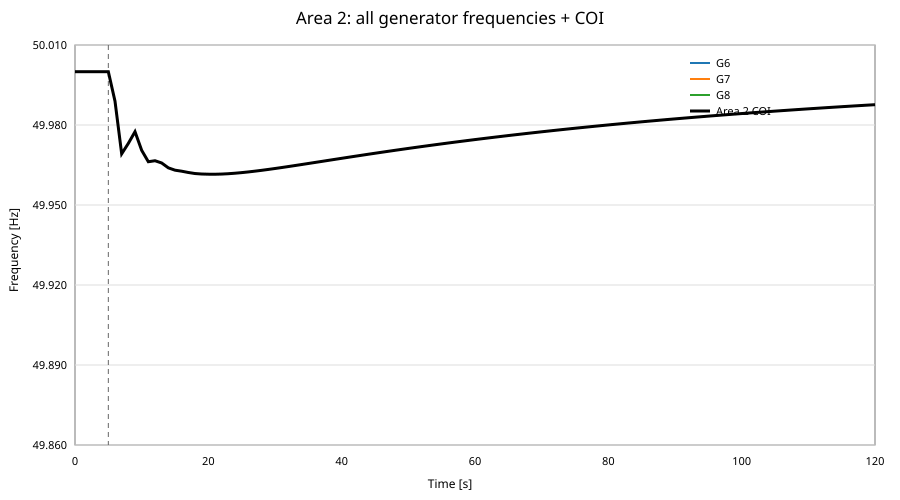
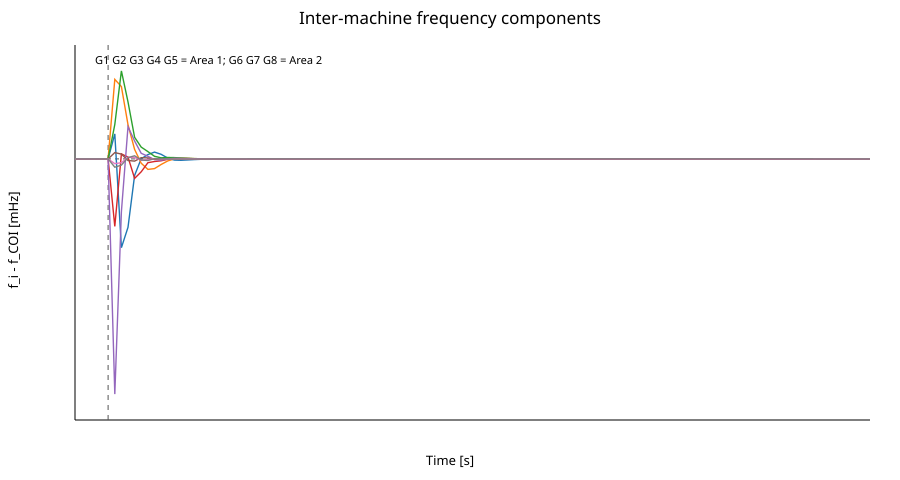

# Two synchronous hydro areas: heterogeneous multi-machine AGC and inter-machine oscillations

This study extends the single-unit Trollheim AGC benchmark into a heterogeneous 5+3 hydro system. The purpose is no longer only to observe two area frequencies. We now separate the dynamics into:

1. **common area / center-of-inertia (COI) motion**, which determines the bulk area frequency;
2. **inter-area motion**, which appears through the tie-line and relative area angles; and
3. **inter-machine motion**, in which individual hydro generators oscillate around their area's COI trajectory.

A +30 MW load step is applied in Area 1 at `t = 5 s`. The reduced multi-machine reference model is integrated to 120 s with `max_step = 0.1 s`.

## Research questions

1. When different Trollheim-like hydro units have different ratings, inertia, droop, transient droop, governor time constants and gate-rate limits, how different are their individual rotor-frequency trajectories?
2. Is an area frequency simply the arithmetic sum or average of individual generator frequencies?
3. How large are the inter-machine oscillations relative to the common area-frequency motion?
4. How does a disturbance in Area 1 propagate to Area 2 through tie-line synchronizing power?
5. How do permanent droop, transient droop, rate limits and secondary ACE interact in a heterogeneous hydro fleet?
6. Which units contribute most strongly to the first few seconds of frequency containment, and which limitations make the response slower?

---

# 1. System definition

```text
                     AREA 1                                              AREA 2

     G1      G2      G3      G4      G5                 G6       G7       G8
    180MW   150MW   130MW   110MW    90MW              170MW    130MW    100MW
      |       |       |       |       |                   |        |        |
  Trollheim-like nonlinear hydro units              Trollheim-like nonlinear hydro units
      |       |       |       |       |                   |        |        |
      +-------+-------+-------+-------+                   +--------+--------+
                    Area-1 COI ----- AC tie line ----- Area-2 COI
                            P12 = K12(delta1-delta2)
```

Area 1 installed power is **660 MW** and Area 2 installed power is **400 MW**. Unit sizes intentionally vary rather than using eight identical 150 MW plants.

## 1.1 Heterogeneous hydro-generator parameters

The first comparison uses roughly 1x-2x spreads where physically useful. These are benchmark values, not claimed Trollheim measurements.

| Unit | Area | S [MW] | H [s] | R | Tg [s] | Tt [s] | transient T [s] | transient gain | gate-rate [pu/s] | Ksync [MW/rad] |
|---|---:|---:|---:|---:|---:|---:|---:|---:|---:|---:|
| G1 | 1 | 180 | 4.8 | 0.040 | 0.22 | 0.80 | 4.0 | 1.00 | 0.14 | 150 |
| G2 | 1 | 150 | 4.2 | 0.045 | 0.28 | 1.00 | 5.0 | 1.20 | 0.12 | 135 |
| G3 | 1 | 130 | 3.8 | 0.050 | 0.35 | 1.20 | 6.0 | 1.40 | 0.10 | 120 |
| G4 | 1 | 110 | 3.4 | 0.055 | 0.42 | 1.40 | 7.5 | 1.60 | 0.09 | 105 |
| G5 | 1 | 90 | 3.0 | 0.060 | 0.50 | 1.60 | 9.0 | 1.80 | 0.08 | 95 |
| G6 | 2 | 170 | 4.5 | 0.045 | 0.25 | 0.90 | 4.5 | 1.10 | 0.13 | 145 |
| G7 | 2 | 130 | 3.7 | 0.052 | 0.36 | 1.25 | 6.5 | 1.45 | 0.10 | 120 |
| G8 | 2 | 100 | 3.1 | 0.060 | 0.48 | 1.55 | 8.0 | 1.80 | 0.08 | 100 |

The comparison is deliberate: the larger units are given somewhat larger inertia, faster governor/turbine response and larger gate-rate capability, while the smaller units are slower and more strongly limited. Later sensitivity studies can reverse these assumptions independently.

---

# 2. Machine-level problem formulation

For generator `i`, define rotor-angle deviation `delta_i`, frequency deviation `Delta f_i`, turbine mechanical power `Pm_i`, electrical power `Pe_i`, guide-vane state `g_i`, transient-droop state `z_i`, rating `S_i` and inertia constant `H_i`.

## 2.1 Rotor angle

```text
d(delta_i)/dt = 2*pi*Delta f_i
```

## 2.2 Swing equation

Using MW and Hz quantities,

```text
d(Delta f_i)/dt = f0/(2*H_i*S_i) *
                  [Pm_i - Pe_i - D_i*Delta f_i]
```

The electrical power of each machine is decomposed as

```text
Pe_i = Pload,i
     + Ksync,i*(delta_i - delta_COI,area)
     + alpha_i*P_tie,area .
```

`Ksync,i*(delta_i-delta_COI)` is the local synchronizing-power term. It is what allows one rotor to swing against the rest of its own area instead of forcing all machines to have exactly the same frequency state.

## 2.3 Area center-of-inertia frequency

The area frequency is **not** the simple arithmetic sum of generator frequencies. We define

```text
f_COI,a = sum_i(H_i*S_i*f_i) / sum_i(H_i*S_i),    i in area a .
```

Likewise,

```text
delta_COI,a = sum_i(H_i*S_i*delta_i) / sum_i(H_i*S_i) .
```

The inertia weight `H_i*S_i` matters. A 180 MW, high-inertia unit should affect the measured bulk motion more than a 90 MW, low-inertia unit.

## 2.4 Inter-machine frequency component

For each generator,

```text
Delta f_inter,i = f_i - f_COI,area(i) .
```

This quantity removes the common area motion and exposes only the relative machine oscillation.

Therefore the useful decomposition is

```text
f_i(t) = f_COI,area(t) + Delta f_inter,i(t) .
```

In a linearized model the full response can be interpreted as a modal superposition of a common/COI mode, an inter-area mode and local inter-machine modes. It is not correct to say that the physical area frequency is the literal unweighted superposition of the individual frequencies.

---

# 3. Hydro governor formulation

The hydro governor is intentionally heterogeneous.

Let

```text
e_i = Delta f_i/f0 .
```

## 3.1 Permanent droop

```text
u_droop,i = -e_i/R_i .
```

A lower `R_i` gives stronger primary response.

## 3.2 Transient droop / temporary compensation

A low-pass transient state is used,

```text
T_r,i * dz_i/dt = e_i - z_i .
```

The high-pass part is

```text
e_transient,i = e_i - z_i .
```

and temporary droop compensation is represented by

```text
u_transient,i = -K_td,i*(e_i-z_i) .
```

Immediately after the event, `e_i-z_i` is large. As `z_i` catches the slower frequency component, the temporary term fades. This is useful for hydro units where a strong immediate command should not remain permanently applied.

## 3.3 Secondary ACE contribution

For Area 1,

```text
ACE1 = B1*(f_COI,1-f0)/f0 + P12/Sbase,1 .
```

For Area 2,

```text
ACE2 = B2*(f_COI,2-f0)/f0 - P12/Sbase,2 .
```

The area integrator is

```text
d(xi_a)/dt = ACE_a .
```

The unit command contains

```text
u_AGC,i = -Ki,a * xi_a .
```

The total unconstrained guide-vane command is therefore

```text
u_cmd,i = u0,i
        - e_i/R_i
        - K_td,i*(e_i-z_i)
        - Ki,a*xi_a .
```

## 3.4 Gate servomotor with rate limiter

The unconstrained servo rate is

```text
r_i = (u_cmd,i - g_i)/Tg_i .
```

The actual motion is

```text
dg_i/dt = clamp(r_i, -rmax_i, +rmax_i) .
```

This is important. Two units can receive the same AGC request but produce different mechanical-power trajectories because one guide vane can move at 0.14 pu/s while another is limited to 0.08 pu/s.

## 3.5 Turbine power lag

For the reduced reference model,

```text
Tt_i*dPm_i/dt = S_i*g_i - Pm_i .
```

In the full OpenHPL model this first-order block is replaced by the nonlinear waterway + turbine dynamics.

---

# 4. Tie-line formulation

Area relative angle evolves from the difference in COI frequencies,

```text
d(delta12)/dt = 2*pi*(f_COI,1-f_COI,2)
```

and

```text
P12 = K12*delta12 .
```

Positive `P12` means Area 1 exports to Area 2.

The first heterogeneous test uses

```text
K12 = 5 MW/rad .
```

---

# 5. Disturbance and numerical experiment

Initial operating point:

```text
Pm_i(0) = Pload,i(0) = 0.5*S_i
f_i(0)  = 50 Hz
```

At `t = 5 s`, Area 1 receives

```text
Delta P_L1 = +30 MW .
```

The disturbance is distributed across the Area-1 electrical load in proportion to machine rating. This is only a bookkeeping allocation; the machines still interact through their rotor angles and synchronizing powers.

The numerical integration is

```text
t = 0 ... 120 s
max_step = 0.1 s
rtol = 1e-7
atol = 1e-9
```

Thus the requested discretization ceiling is **1/10 s**. The adaptive integrator is still allowed to take smaller internal steps when required.

---

# 6. First heterogeneous simulation results

| Metric | Result |
|---|---:|
| Area-1 COI nadir | **49.87685 Hz** |
| Area-2 COI nadir | **49.96153 Hz** |
| Peak absolute tie-line power | **8.96533 MW** |
| Area-1 COI at 120 s | **49.98855 Hz** |
| Area-2 COI at 120 s | **49.98762 Hz** |
| Tie-line power at 120 s | **-1.55456 MW** |
| Maximum Area-1 inter-machine deviation | **9.58 mHz** |
| Maximum Area-2 inter-machine deviation | **0.30 mHz** |

These numbers come from `two_area_reference.py`, which now contains eight independent machine states rather than one equivalent frequency state per area.

## 6.1 COI response



Area 1 experiences the direct disturbance and therefore has the deeper initial nadir. Area 2 follows through the tie-line, but its first excursion is smaller.

## 6.2 Area 1: all generator frequencies and Area-1 COI



This plot overlays `G1 ... G5` with the inertia-weighted Area-1 COI frequency. The black COI trajectory is the bulk area motion; the small separation between the individual machine traces represents the local inter-machine component. Because the disturbance is applied in Area 1, this is where the largest machine-to-machine separation appears.

## 6.3 Area 2: all generator frequencies and Area-2 COI



This plot overlays `G6 ... G8` with the Area-2 COI frequency. Area 2 is disturbed only through the tie line, so its generators remain much more coherent than the Area-1 machines.

**For direct visual comparison, the Area-1 and Area-2 plots use exactly the same frequency axis:**

```text
ymin = 49.86 Hz
ymax = 50.01 Hz
```

The Area-2 plot is therefore intentionally not re-zoomed. Its visibly smaller spread is a physical result of this benchmark rather than a plotting artifact.

## 6.4 Inter-machine oscillation



The plotted quantity is `f_i - f_COI`. The important observation is that the large common frequency motion disappears after COI subtraction, leaving a much smaller local electromechanical oscillation.

In this first parameter set the maximum local spread in Area 1 is about 9.6 mHz. Area 2 is much more coherent, with less than 0.3 mHz deviation, because it is not directly subjected to the load step.

This confirms the conceptual separation:

```text
large signal seen by grid operator  -> COI / area-frequency motion
small relative rotor motion         -> inter-machine oscillation
relative Area-1 vs Area-2 motion    -> inter-area / tie-line mode
```

---

# 7. Answer: is Area-1 frequency the superposition of all generator frequencies?

Not in the simple sense.

If all five machines were forced to the same shaft/frequency node, then there would be exactly one Area-1 frequency and no inter-machine mode. That was effectively the coherent approximation in the earlier model.

Once each generator has an independent rotor state, we have five frequencies `f1 ... f5`. A meaningful bulk Area-1 frequency is the inertia-weighted COI value

```text
f_COI,1 = sum(H_i*S_i*f_i)/sum(H_i*S_i).
```

Each physical generator frequency can then be decomposed as

```text
f_i = f_COI,1 + Delta f_inter,i .
```

So the language of **superposition** is appropriate after linearization in the modal sense: common mode + inter-area mode + local machine modes. For nonlinear transient simulation, the COI definition plus individual deviations is the safer interpretation.

---

# 8. What the heterogeneous parameters are testing

The present spread lets us compare several effects simultaneously:

- **rating:** 90-180 MW in Area 1 and 100-170 MW in Area 2;
- **inertia:** approximately 3.0-4.8 s;
- **permanent droop:** 4-6%;
- **governor time constant:** 0.22-0.50 s;
- **turbine time constant:** 0.8-1.6 s;
- **transient-droop time constant:** 4-9 s;
- **transient-droop gain:** 1.0-1.8;
- **gate-rate limit:** 0.08-0.14 pu/s;
- **local synchronizing coefficient:** 95-150 MW/rad.

This creates a useful benchmark family. The next comparison should vary one parameter family at a time instead of changing everything together:

```text
Case A: identical machines
Case B: rating + inertia only heterogeneous
Case C: droop + transient droop heterogeneous
Case D: gate-rate limits heterogeneous
Case E: all heterogeneity combined
```

Then the change in inter-machine damping and COI nadir can be attributed to a specific physical/control cause.

---

# 9. Files

```text
OpenHPL/Examples/TwoAreaAGC/
├── README.md
├── TwoAreaTieLineAGC.mo
├── two_area_reference.py
└── results/
    ├── heterogeneous_coi_frequency.svg
    ├── area1_all_generators_plus_coi.svg
    ├── area2_all_generators_plus_coi.svg
    ├── intermachine_frequency_deviation.svg
    ├── frequency_response.svg
    └── tie_line_power.svg
```

`two_area_reference.py` is now the heterogeneous multi-machine benchmark and uses `max_step = 0.1 s`.

The next implementation step is to map the same `S_i`, `H_i`, `R_i`, transient-droop and rate-limit arrays into `TwoAreaTieLineAGC.mo`, so the reduced electromechanical result can be compared directly against the full nonlinear OpenHPL waterways.
