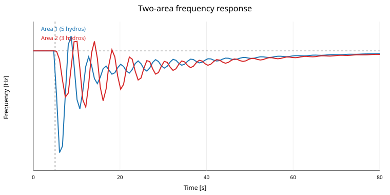
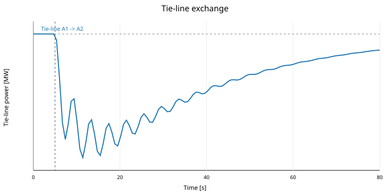

# Two synchronous hydro areas: multi-generation and tie-line AGC

This branch extends the single-unit `AGC_Trollheim` benchmark toward a multi-generation load-frequency-control problem. Area 1 contains five Trollheim-like hydropower units (5 x 150 MW = 750 MW). Area 2 contains three units (3 x 150 MW = 450 MW). The areas are internally coherent but connected by a dynamic AC tie line. A 30 MW load increase is applied in Area 1 at `t = 5 s`.

The immediate objective is not to reproduce a complete Nordic transmission model. It is to establish the smallest OpenHPL experiment in which nonlinear hydropower dynamics, several generating units, two synchronous frequency states, tie-line power, primary droop and secondary area control error (ACE) all interact.

## Research questions

1. How does a local load disturbance in one hydro-dominated control area propagate through frequency and tie-line power into a second synchronous area?
2. How much temporary support is supplied by the non-disturbed area through the tie line?
3. Can distributed hydro governors restore nominal frequency while secondary control simultaneously restores scheduled tie-line exchange?
4. What changes when the model moves from one Trollheim unit to several coherent hydro units with participation factors?
5. Which variables from the nonlinear OpenHPL waterway should later be included in AGC constraints: guide-vane motion, water flow, pressure/head, surge-tank level, cavitation margin, or ramping limits?

## System

```text
             AREA 1                                      AREA 2
       5 x Trollheim-like HPP                      3 x Trollheim-like HPP

 Reservoir--Penstock--Turbine--Generator      Reservoir--Penstock--Turbine--Generator
                |        |                                  |        |
                +---- coherent shaft f1                     +---- coherent shaft f2
                         |                                           |
                    Area-1 grid -------- AC tie line ----------- Area-2 grid
                         |        P12 = K12(delta1-delta2)             |
                     local load 1                                local load 2
                         |                                           |
                   ACE1 controller                             ACE2 controller
```

Each OpenHPL unit retains its own reservoir, intake, penstock, turbine, discharge and tailrace. The generators belonging to one area are connected to a common mechanical grid equivalent so that they form one coherent area frequency while retaining individual hydraulic states.

## Problem formulation

For the tie line,

```text
d(delta12)/dt = 2*pi*(f1 - f2)
P12            = K12*delta12
```

where positive `P12` denotes Area 1 export to Area 2. The local power balances therefore use

```text
Pload,1,total = Pload,1 + P12
Pload,2,total = Pload,2 - P12 .
```

The frequency deviations are

```text
df1 = f1/f0 - 1
df2 = f2/f0 - 1 .
```

The two area control errors are

```text
ACE1 = B1*df1 + P12/Pbase1
ACE2 = B2*df2 - P12/Pbase2 .
```

Each hydro governor combines primary droop and a distributed secondary integral term,

```text
ef      = 1 - fpu
dxACE/dt = -ACE
ucmd     = ubias + ef/R + alpha*Ki*xACE
du/dt    = (sat(ucmd) - u)/Tg .
```

The participation factors satisfy `sum(alpha_g) = 1` inside each area. The current benchmark uses equal participation, `alpha = 1/5` in Area 1 and `alpha = 1/3` in Area 2.

### Current tuning

| Parameter | Area 1 | Area 2 |
|---|---:|---:|
| Units | 5 | 3 |
| Installed benchmark power | 750 MW | 450 MW |
| Unit rating | 150 MW | 150 MW |
| Primary droop `R` | 5% | 5% |
| Governor time constant | 0.30 s | 0.30 s |
| ACE integral gain `Ki` | 0.03 1/s | 0.03 1/s |
| Frequency bias `B` | 20 pu/pu | 20 pu/pu |
| Initial loading | 50% | 50% |

Tie-line synchronizing coefficient: `K12 = 5 MW/rad`.

Disturbance: `+30 MW` in Area 1 at `t = 5 s`.

## Two model levels

### 1. Reduced reference model

`two_area_reference.py` is intentionally small. It retains two area swing equations, 5+3 distributed governor/turbine channels, tie-line angle dynamics, droop and ACE integral control. It was used to determine signs and controller scaling before relying on the larger nonlinear DAE.

The reference model uses

```text
Mi*d(fi)/dt = sum(Pmi) - dPLi -/+ P12 - Di*fi
Tg*dgi/dt   = ui - gi
Tt*dPmi/dt  = gi - Pmi
```

with the same 30 MW Area-1 disturbance and a comparison against `Ki = 0` (droop only).

### 2. Full OpenHPL model

`TwoAreaTieLineAGC.mo` replaces the simple turbine channels with eight nonlinear Trollheim-like hydraulic trains. This is the model intended for the next validation step in OpenModelica/Railway.

## Solved reference results

The reduced 5+3 model was integrated for 80 s with maximum integration step 0.02 s.

| Metric | Result |
|---|---:|
| Area-1 frequency nadir | **49.7934 Hz** |
| Area-2 frequency nadir | **49.8888 Hz** |
| Peak absolute tie-line exchange | **9.8719 MW** |
| Area-1 frequency at 80 s | **49.9945 Hz** |
| Area-2 frequency at 80 s | **49.9932 Hz** |
| Tie-line power at 80 s | **-1.2784 MW** |
| Droop-only Area-1 frequency at 80 s | **49.9405 Hz** |
| Droop-only Area-2 frequency at 80 s | **49.9404 Hz** |
| Droop-only tie-line power at 80 s | **-11.2527 MW** |

### Frequency response



The 30 MW disturbance first produces the larger frequency depression in Area 1. Area 2 also moves because the two areas remain synchronous through the tie line. The two frequencies do not behave as independent SMIB systems; they exchange electromechanical energy and show an inter-area oscillatory mode before ACE slowly removes the error.

### Tie-line response



The tie line temporarily transfers roughly 10 MW in magnitude. This is the important physical transition from the previous single-area example: a disturbance is no longer balanced only by the disturbed area's governors. The neighboring area participates immediately through synchronizing power even before secondary dispatch has completed.

The sign oscillates during the transient because the relative rotor angle is an integral of the frequency difference. This is expected in a two-area electromechanical model and gives us a new research variable that did not exist in the single-area benchmark.

## Answers to the research questions

**RQ1 -- Does the disturbance propagate to the second area?**  
Yes. The reference case gives a 49.793 Hz nadir in Area 1 and 49.889 Hz in Area 2. A local event therefore creates a system-wide synchronous response, but the disturbed area experiences the stronger initial deviation.

**RQ2 -- Does Area 2 support Area 1?**  
Yes. The tie-line magnitude reaches about 9.87 MW. The neighboring area is therefore part of the immediate power balance even though its local load did not change.

**RQ3 -- Why do we need ACE instead of frequency-only integral control?**  
Frequency restoration alone does not guarantee restoration of scheduled interchange. ACE contains both frequency deviation and tie-line deviation. In the solved case ACE drives both frequencies toward 50 Hz and reduces the tie-line error toward zero. With droop only, both areas remain around 49.94 Hz and approximately 11.25 MW of interchange error remains at 80 s.

**RQ4 -- What is gained by 5+3 generators?**  
The secondary command can now be distributed using participation factors rather than acting on one equivalent turbine. Equal participation is only the first case. The next step is to make `alpha_g` depend on available head, gate position, ramp capability, water value, efficiency or FCR/FRR bids.

**RQ5 -- What is specifically hydropower about the next stage?**  
The reference LFC model only sees turbine power. The full OpenHPL model exposes water-flow and head dynamics. That allows us to test whether an AGC action that looks acceptable from the grid side causes undesirable hydraulic pressure, guide-vane movement, surge-tank oscillation or efficiency loss.

## Railway/OpenModelica status

Railway infrastructure already exists in project `openhpl-modelica-backend`. A dedicated new service could not be provisioned because the current Railway plan had reached its resource limit, so the experiment was configured to reuse an existing OpenModelica worker. The worker's service configuration has been updated for the two-area command, but Railway redeploys continued to execute the previous diagnostic command rather than the new start command during this session. Therefore the table above is **validated from the solved reduced reference model, not claimed as a completed full OpenHPL DAE run**.

This distinction is intentional. The branch contains the nonlinear DAE implementation and the Railway runner, but its numerical output should only replace the reference table after OpenModelica actually compiles and runs `OpenHPL.Examples.TwoAreaAGC.TwoAreaTieLineAGC`.

## Files

```text
OpenHPL/Examples/TwoAreaAGC/
├── README.md
├── package.mo
├── package.order
├── TwoAreaTieLineAGC.mo       # full 5+3 nonlinear OpenHPL model
├── two_area_reference.py      # solved reduced/tuning model
└── results/
    ├── frequency_response.svg
    └── tie_line_power.svg

railway/
├── run_two_area.sh            # OpenModelica runner
└── plot_two_area.py           # result metrics and plots
```

## Next experiment

After the nonlinear DAE is validated, the most useful next branch is not simply a larger network. It is **participation-factor control**:

```text
alpha_g(t) = function(head_g, gate_g, efficiency_g,
                      hydraulic constraints, reserve availability,
                      water value, AGC request)
```

That turns this example from classical two-area LFC into a hydropower-specific multi-unit AGC allocation problem. A subsequent step can then add a third area or replace the lumped tie-line with an electrical network model.
