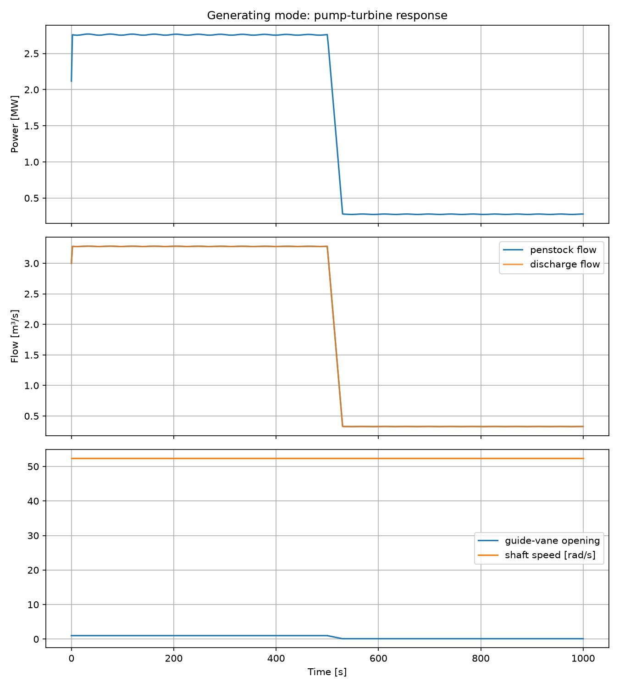
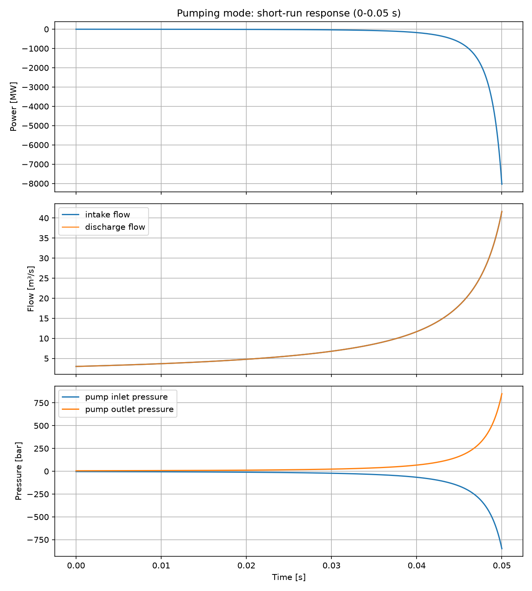

# PumpTurbine Model Report

This document summarizes the simple reversible pump-turbine model added to OpenHPL and includes the generated simulation plots.

## Model files

- Model: `/home/runner/work/OpenHPL/OpenHPL/OpenHPL/ElectroMech/Turbines/PumpTurbine.mo`
- Example: `/home/runner/work/OpenHPL/OpenHPL/OpenHPL/Examples/SimplePumpTurbine.mo`
- Tests:
  - `/home/runner/work/OpenHPL/OpenHPL/OpenHPLTest/PumpTurbine/TestGenerating.mo`
  - `/home/runner/work/OpenHPL/OpenHPL/OpenHPLTest/PumpTurbine/TestPumping.mo`

## Model summary

`PumpTurbine` is a simple reversible hydraulic machine that supports two operating modes:

- **Turbine mode**: positive shaft power generation
- **Pump mode**: negative shaft power, representing power consumption to add head to the water

Main model features:

- separate nominal head and flow parameters for turbine and pump operation
- constant or table-based efficiency in turbine mode
- constant efficiency in pump mode
- shared OpenHPL hydraulic connectors and mechanical shaft model via `Power2Torque`
- Boolean mode input `pumpMode_in` with parameter-based default selection

## Model source

```modelica
within OpenHPL.ElectroMech.Turbines;
model PumpTurbine "Simple reversible pump-turbine model with mechanical connectors"
  extends BaseClasses.Power2Torque(f_0=data.f_0, power(y=Wdot_s));
  extends Interfaces.TurbineContacts;
  extends Interfaces.TwoContacts;
  extends Icons.Turbine;

  type OperatingMode = enumeration(
      Turbine "Generating mode",
      Pump "Pumping mode");

  parameter OperatingMode mode = OperatingMode.Turbine "Default operating mode"
    annotation (Dialog(group = "Operating mode"));
  parameter Boolean enable_modeInput = false
    "If checked, use Boolean input to switch between turbine and pump mode"
    annotation (choices(checkBox = true), Dialog(group = "Operating mode", tab = "I/O"));
  parameter SI.Height H_turbine_n = 100 "Nominal head in turbine mode"
    annotation (Dialog(group = "Nominal values"));
  parameter SI.VolumeFlowRate Vdot_turbine_n = 3 "Nominal volume flow rate in turbine mode"
    annotation (Dialog(group = "Nominal values"));
  parameter SI.Height H_pump_n = H_turbine_n "Nominal head rise in pump mode"
    annotation (Dialog(group = "Nominal values"));
  parameter SI.VolumeFlowRate Vdot_pump_n = Vdot_turbine_n "Nominal volume flow rate in pump mode"
    annotation (Dialog(group = "Nominal values"));
  parameter SI.PerUnit u_turbine_n = 1 "Nominal opening in turbine mode"
    annotation (Dialog(group = "Nominal values"));
  parameter SI.PerUnit u_pump_n = 1 "Nominal opening in pump mode"
    annotation (Dialog(group = "Nominal values"));
  parameter Real alpha = 1
    "Exponent of opening curve for both modes"
    annotation (Dialog(tab = "Advanced", group = "Opening law"));
  parameter Boolean ConstEfficiency = true
    "If checked the constant turbine efficiency eta_h is used, otherwise specify lookup table for turbine efficiency"
    annotation (Dialog(group = "Turbine efficiency"), choices(checkBox = true));
  parameter SI.Efficiency eta_h = 0.9 "Hydraulic efficiency in turbine mode"
    annotation (Dialog(group = "Turbine efficiency", enable = ConstEfficiency));
  replaceable parameter OpenHPL.Types.Efficiency VarEfficiency constrainedby OpenHPL.Types.Efficiency
    "Turbine efficiency lookup table as function of guide-vane opening"
    annotation (choicesAllMatching = true, Dialog(group = "Turbine efficiency", enable = not ConstEfficiency));
  parameter SI.Efficiency eta_p = 0.9 "Hydraulic efficiency in pump mode"
    annotation (Dialog(group = "Pump efficiency"));
  Modelica.Blocks.Interfaces.BooleanInput pumpMode_in = mode == OperatingMode.Pump
    "False = turbine mode, true = pump mode"
    annotation (Placement(transformation(origin = {-40, 120}, extent = {{-20, -20}, {20, 20}}), iconTransformation(origin = {-40, 120}, extent = {{-20, -20}, {20, 20}})));
  Modelica.Blocks.Math.Feedback lossCorrection
    annotation (Placement(transformation(extent = {{-50, 70}, {-30, 90}})));
  Modelica.Blocks.Tables.CombiTable1Dv efficiencyCurve(
    table = VarEfficiency.EffTable,
    smoothness = Modelica.Blocks.Types.Smoothness.ContinuousDerivative,
    extrapolation = Modelica.Blocks.Types.Extrapolation.LastTwoPoints)
    "Efficiency curve in turbine mode"
    annotation (Placement(transformation(origin = {-70, -70}, extent = {{-10, -10}, {10, 10}})));
  output Modelica.Units.SI.EnergyFlowRate Wdot_s
    "Shaft power, positive in turbine mode and negative in pump mode";

protected
  parameter Real C_v_turbine = Vdot_turbine_n / sqrt(H_turbine_n * data.g * data.rho) / u_turbine_n
    "Equivalent valve capacity in turbine mode";
  parameter Real C_v_pump = Vdot_pump_n / sqrt(H_pump_n * data.g * data.rho) / u_pump_n
    "Equivalent valve capacity in pump mode";
  constant Real epsilon = 5.0e-5 "Regularization constant";
  SI.Pressure dp "Pressure difference, inlet minus outlet";
  SI.MassFlowRate mdot "Mass flow rate";
  SI.VolumeFlowRate Vdot "Volume flow rate";
  SI.EnergyFlowRate Wdot_h "Hydraulic power transfer";
  SI.PerUnit opening "Limited guide-vane opening";
  SI.Efficiency eta_t "Effective turbine efficiency";
  Boolean pumpModeActive "Resolved operating mode";

equation
  i.mdot + o.mdot = 0;
  mdot = i.mdot;
  Vdot = mdot / data.rho;
  dp = i.p - o.p;
  o.elevation.z = i.elevation.z "Elevation propagation: no height change across pump-turbine";

  opening = min(1, max(0, u_t));
  efficiencyCurve.u[1] = opening;
  eta_t = if ConstEfficiency then eta_h else efficiencyCurve.y[1];
  pumpModeActive = pumpMode_in;

  if pumpModeActive then
    (-dp) * (C_v_pump * max(epsilon, opening ^ alpha)) ^ 2 = Vdot * abs(Vdot);
    Wdot_h = dp * Vdot;
    Wdot_s = Wdot_h / max(eta_p, epsilon);
  else
    dp * (C_v_turbine * max(epsilon, opening ^ alpha)) ^ 2 = Vdot * abs(Vdot);
    Wdot_h = dp * Vdot;
    Wdot_s = eta_t * Wdot_h;
  end if;

  connect(P_out, lossCorrection.y);
  connect(lossCorrection.u1, power.y);
  connect(frictionLoss.power, lossCorrection.u2);
end PumpTurbine;
```

## Simulation notes

Two simulations were used for visualization:

1. `OpenHPLTest.PumpTurbine.TestGenerating` — full run to `t = 1000 s`
2. `OpenHPLTest.PumpTurbine.TestPumping` — short run to `t = 0.05 s`

The short pumping run was used because the current pumping configuration becomes numerically unstable shortly after that interval.

## Plots

### Generating mode



### Pumping mode (short run)



## Observations

- generating mode completes successfully and shows positive shaft power output
- pumping mode shows negative shaft power as expected for power-consuming operation
- the current pumping setup reaches very large pressure and power values and becomes unstable after the short visualization interval
