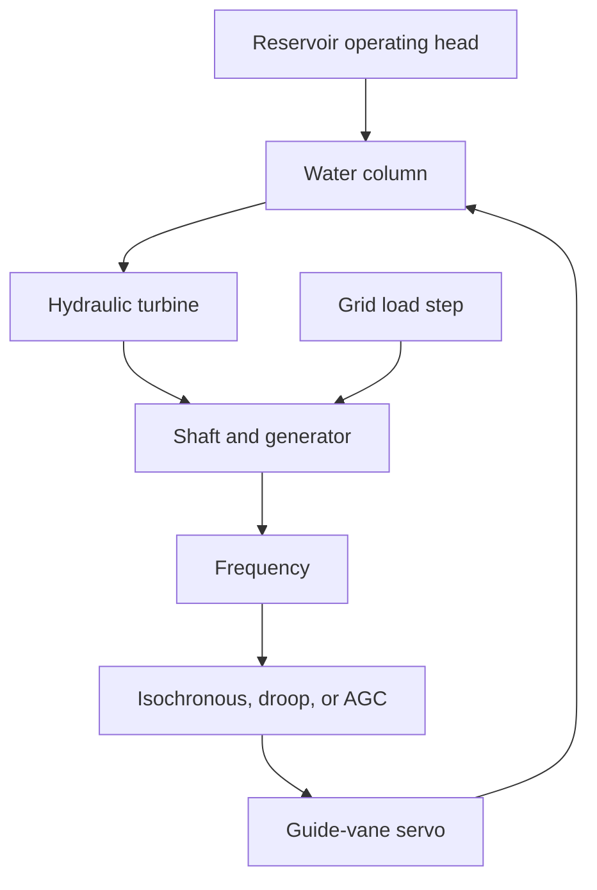
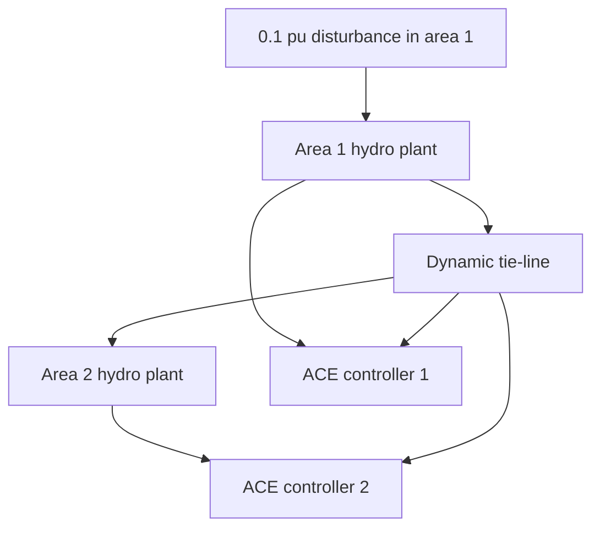
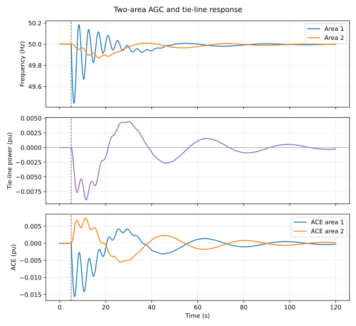

# Trollheim equation-based frequency-control study

This study compares three single-area controller structures and one two-area tie-line case using the same reduced-order
hydraulic and electromechanical plant. The operating point is 0.5 pu at 50 Hz.
At 5 s, electrical load increases by 0.1 pu.

## Component model

The diagram is acausal at the study level: component equations and connector
equalities form one system that OpenModelica translates and solves.

| Component | Deviation equation |
|---|---|
| Guide-vane servo | `T_g d(Δy)/dt = sat(u) - Δy` |
| Water column | `T_w d(Δq)/dt = Δy - Δq - k_q Δq abs(Δq)` |
| Turbine | `ΔP_m = K_t Δq (1 - α Δq)` |
| Shaft-generator | `2H d(Δf)/dt = ΔP_m - ΔP_e - D Δf` |
| Grid event | `ΔP_e = 0` before 5 s and `0.1 pu` afterwards |

Controller equations are:

- Isochronous PI: `dξ/dt = -Δf`, `u = -K_p Δf + K_i ξ`
- Droop: `u = -Δf/R`, with `R = 0.05`
- AGC: `dP_sec/dt = -K_i B Δf`,
  `u = -Δf/R + P_sec`

This is a transparent control-development model. The next fidelity level can
replace the water-column and turbine blocks with the full nonlinear OpenHPL
waterway, surge-tank, and turbine components while retaining the same
controller interfaces.

## Automatically generated results

The exact nadir and final-frequency values are written to
[metrics.csv](results/metrics.csv). GitHub Actions also stores the raw
OpenModelica CSV files and complete solver log as a downloadable artifact.

## Reproduce in GitHub Actions

Open **Actions → OpenModelica simulation → Run workflow**. Select the
`github-actions-openmodelica` branch. The workflow installs the Modelica
libraries, runs all three cases, validates every CSV, creates the plots, and
publishes the latest plots back to this folder.

## Two-area tie-line model

The tie-line state and area-control errors are

- `d(ΔP_tie)/dt = 2π T_12 (Δf_1 - Δf_2)`
- `ACE_1 = B_1 Δf_1 + ΔP_tie`
- `ACE_2 = B_2 Δf_2 - ΔP_tie`

Both secondary controllers integrate their own ACE. Therefore area 2 initially
supports area 1 through the tie-line, while AGC later restores both frequencies
and returns scheduled tie-line exchange toward zero.

Exact two-area values are in
[tie_line_metrics.csv](results/tie_line_metrics.csv).
