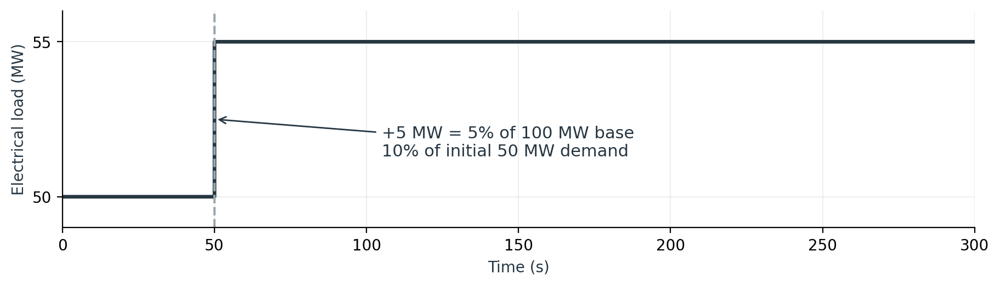
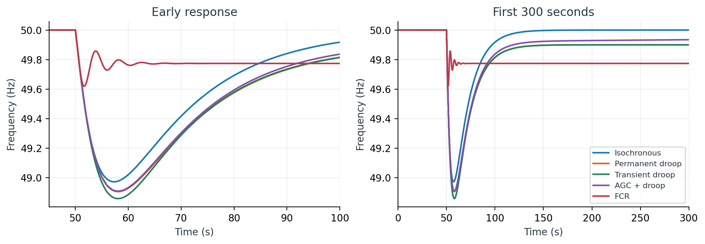

# NewTest load-step validation

## Research briefing and experiment design

The [research report](research_report/README.md) explains the experiment boundary,
measured simulation responses, performance metrics and relevance to Statnett review.
A [shareable PDF](research_report/OpenHPL_research_briefing.pdf),
[194-row experiment matrix](research_report/experiment_matrix.csv),
[metric table](research_report/metrics.csv), and reusable PNG/SVG figures are included.
Five matrix rows reuse completed baseline runs; 189 are proposed and have not run.





To rebuild the report from the archived compact CSVs, install `numpy`, `matplotlib`
and `reportlab`, then run `python validation/research_report.py` from the repository root.
The builder checks the recorded model-source hashes before using those results.

The local models in `OpenHPLTest/NewTest` now use the OpenHPL 4 interfaces, including hydraulic i/o ports, a turbine-to-generator mechanical flange, a dynamic generator frequency output, and conversion from per-unit frequency to Hz. The governor drives the gate actuator; actual gate position feeds back to the governor. Diagram placements and connection lines are included in all nine examples.

The seven hydraulic examples apply an electrical load increase from 50 MW to 55 MW at 50 s. Reservoir levels are held constant. The generator contains the total inertia (H = 4 s on 100 MW); turbine inertia is zero to avoid counting it twice. Electrical demand is converted to shaft demand using efficiency 0.99. Initial gate position is solved from hydraulic and shaft equilibrium. FCR bias is also solved at initialization.

## Measured results

OpenModelica 1.26.0, Modelica Standard Library 4.1.0 (selected as compatible with requested 4.0.0), DASSL, tolerance 1e-7. All nine models passed equation checks and completed simulations.

| Controller | Minimum frequency (Hz) | Final frequency (Hz) | Stop time (s) |
|---|---:|---:|---:|
| Isochronous | 48.97185 | 50.00000 | 300 |
| Permanent droop | 48.90527 | 49.90000 | 300 |
| Transient droop | 48.85810 | 49.90000 | 300 |
| AGC with permanent droop | 48.90762 | 49.99986 | 8000 |
| FCR | 49.61940 | 49.77379 | 300 |

The 4% permanent-droop prediction is 50 × (1 − 0.04 × 5/100) = 49.9 Hz, matching both droop examples. The hydraulic FCR test and comparison harness reproduce the FCR result. The controller-only FCR step harness delivers 0.1 pu additional gate opening, reaching 90% after 1.972 s. The sinusoidal harness also completes.

All hydraulic cases start at 50 Hz, remain within the gate position/rate limits, and finish with shaft power imbalance below 2 W. The validation script checks startup, final droop/frequency recovery, finite results, simulation completion, gate limits and final power balance. CSV sample-based nadirs and rates depend on output resolution; AGC uses 1 s output intervals, others 0.1 s.

These are illustrative controller settings: the roughly 1 Hz dips in the PI-governor cases and slow AGC recovery remain visible and warrant tuning. No grid-code performance claim is made. The `electricalGeneration` trace is 0.99 times turbine power; during transients it includes power accelerating the rotor and is not the imposed electrical load.

## Inspect and rerun

Load both `OpenHPL/package.mo` and `OpenHPLTest/package.mo` in OMEdit, then select `OpenHPLTest.NewTest.IsochronousControl` (or another example). Plot `frequency`, `gateOpening`, `electricalDemand`, `mechanicalPower`, and `powerImbalance` for the main examples.

From the repository root, with `omc`, Python, NumPy and Matplotlib installed:

```powershell
python validation/load_step.py
```

`results/load_step.png` shows the responses; `results/summary.json` contains metrics. Compact result CSVs and SHA-256 hashes of the validated Modelica sources (normalized to LF line endings) are included. Full solver CSVs and compilation artifacts are generated in `results/build`, with the solver log in `results/simulation.log`; these generated files are excluded from Git. Successful fresh runs also refresh the compact CSV archives and model-source manifest.

## Solver diagnostics

The upstream constant-level Reservoir repeats `h = h_0` in its initial and regular equations; OpenModelica removes these redundant initial equations. It also fixes one otherwise unspecified shaft reference angle. Detailed initialization diagnostics identified these exact causes; all models initialize and simulate successfully. The full library requests OpenIPSL 3.0.0, which is absent locally; none of these nine examples instantiates it. No upstream library model was modified to suppress these messages.

## Package relocation validation

The nine cases were rerun as `OpenHPLTest.NewTest` after relocation. The scoped static checker passes for the added package; its graphical-annotation warnings mean it preserves but does not interpret the drawings. A whole-`OpenHPLTest` static check encounters an existing missing `package.mo` in `EmpiricalTurbine/TestBasicFunctions`. OpenModelica loads the parent library and reports an existing stale `Archive/OpenChannel` package-order entry. These unrelated upstream issues are not changed by this addition.
