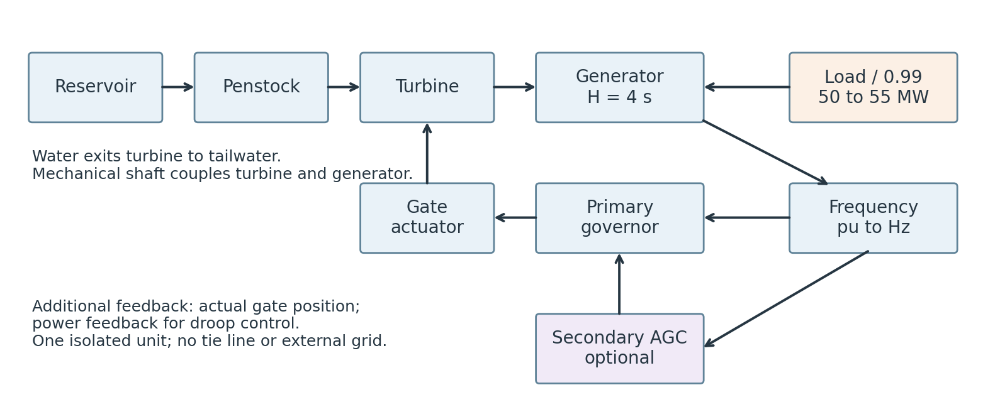
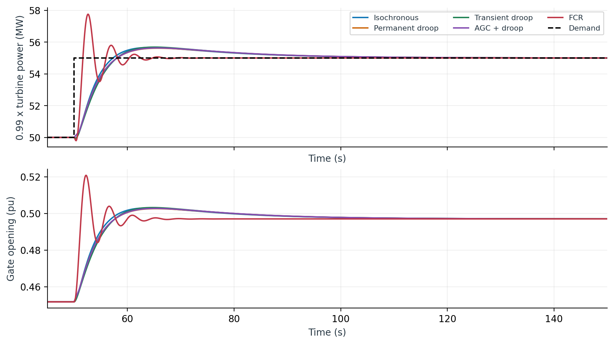
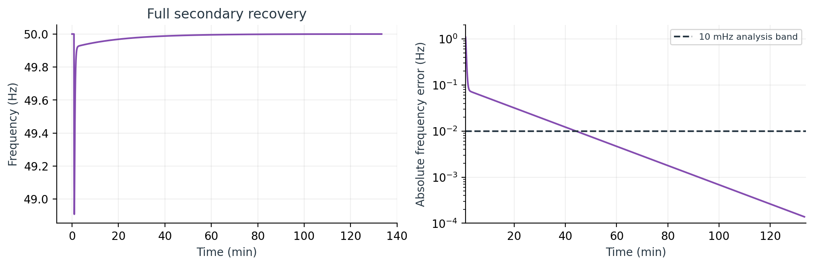
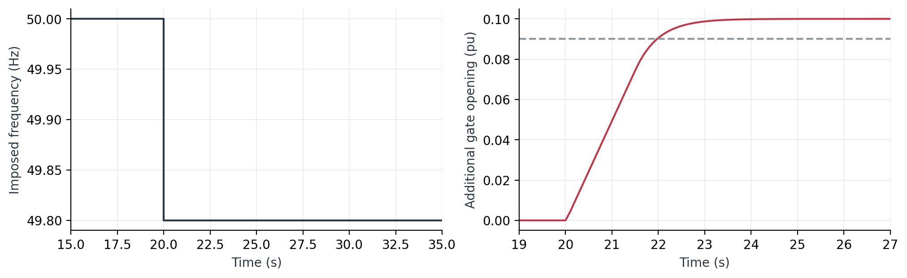

# OpenHPL hydropower control step response study

Research and technical review briefing | 26 September 2026 | Local simulation evidence

OpenHPLTest.NewTest provides a working nonlinear hydropower test bed for studying primary frequency control and secondary restoration. The completed tests reproduce the expected permanent-droop equilibrium and isochronous recovery. The present tuning produces sizeable frequency dips and slow secondary recovery; it is a starting point for research and discussion with Statnett, not an approved reserve-delivery model.

Figure 1. Conceptual architecture of the connected single-unit experiments. The diagram summarizes signal and physical connections; it is not a native Modelica rendering.

| Plant quantity | Baseline value |
| --- | --- |
| Frequency / power base | 50 Hz / 100 MW |
| Initial demand / change | 50 MW / +5 MW at 50 s |
| Inertia / electrical efficiency | H = 4 s / 0.99 |
| Penstock / nominal turbine head | 600 m long, 4 m diameter, 300 m drop / 345 m |
| Reservoir and tailwater levels | 50 m and 5 m, both held constant |
| Gate position / rate limits | 0.01 to 1 pu / +/-0.05 pu/s |

The generator carries the total inertia; turbine inertia is zero to avoid duplication. Initial hydraulic flow, gate position and shaft power balance are solved at equilibrium. The current boundary has no electrical network, load-frequency damping, tie line, voltage-control loop or multi-unit sharing.

## Load disturbance and primary frequency response

Figure 2. Actual archived electrical-load signal: 50 MW before 50 s and 55 MW thereafter. The same step is applied to all five main control architectures.

Figure 3. Measured simulated frequency. The AGC trace is shown only over the first 300 s here; its full run is 8000 s. Different gains and feedback structures prevent an equal-tuning ranking.

| Controller | Nadir Hz | Final Hz | End s |
| --- | --- | --- | --- |
| Isochronous | 48.9719 | 50.00000 | 300 |
| Permanent droop | 48.9053 | 49.90000 | 300 |
| Transient droop | 48.8581 | 49.90000 | 300 |
| AGC + droop | 48.9076 | 49.99986 | 8000 |
| FCR | 49.6194 | 49.77379 | 300 |

Load increases before hydraulic power can respond. Rotor kinetic energy initially supplies the deficit, so speed falls. The governor opens the gate and turbine power catches up. The PI-based cases reach nadirs of 48.858 to 48.972 Hz; the more aggressive proportional FCR setting reaches 49.619 Hz and shows damped oscillation.

## Hydraulic power delivery and gate motion

Figure 4. Turbine power expressed on an electrical-equivalent basis and actual gate motion. The plotted supply is 0.99 times turbine shaft power, not independently measured electrical export.

During acceleration, turbine delivery exceeds shaft demand and replenishes rotor kinetic energy. Consequently, the orange or blue supply overshoot is not evidence of extra electrical export to a grid. The imposed electrical load is the dashed line. At equilibrium, electrical-equivalent turbine delivery reaches 55 MW in every case.

The final gate opening is approximately 0.49707 pu, compared with about 0.45183 pu initially. All hydraulic examples remain inside the position and rate limits. FCR approaches the 0.05 pu/s rate limit; the PI-governor cases use approximately 0.009 to 0.011 pu/s. These numbers describe this operating point only.

At unsaturated equilibrium the permanent-droop error is zero: (50 - f)/50 = R (P - P_ref)/P_base. With R = 0.04 and a 5 MW increment on 100 MW, the expected final frequency is 49.9 Hz. Transient droop adds Rt(gate - z), with Tr dz/dt = gate - z; this contribution vanishes at equilibrium, leaving the same offset.

The current transient-droop settings produce a slightly deeper nadir than permanent droop. This result does not establish that transient droop is inferior: its washout gain and time constant have not been optimized, and the controllers have not been matched for bandwidth or control effort.

## Secondary recovery and quantitative response metrics

Figure 5. AGC eventually restores nominal frequency. The logarithmic error plot exposes the long recovery hidden by a narrow linear frequency scale.

SecondaryAGC integrates per-unit frequency error and changes the primary power reference: dx/dt = Ki (50 - f)/50, P_ref = P_schedule + P_base clip(x). The present Ki is 0.02 per second. Final frequency is 49.999862 Hz at 8000 s. This is an isolated-area frequency integrator; it has no tie-line ACE or external automatic reserve activation interface.

| Controller | Nadir after step s | Settle to target s | IAE Hz s |
| --- | --- | --- | --- |
| Isochronous | 7.3 | 81.8 | 24.88 |
| Permanent droop | 8.1 | 82.2 | 49.85 |
| Transient droop | 8.0 | 82.0 | 50.25 |
| AGC + droop | 8.0 | 2596.0 | 43.32 |
| FCR | 1.7 | 10.9 | 56.61 |

Settling means the first sampled time after which frequency remains within +/-0.01 Hz of the target for the remainder of the recorded run. Targets are 50 Hz for isochronous and AGC, 49.9 Hz for both droop cases, and the measured final frequency for FCR. Settling to an offset is not restoration to nominal frequency. Durations in this table start at the load step.

IAE integrates absolute deviation from 50 Hz over the common 50 to 300 s window. Nadirs and settling times are sample-based: 0.1 s output for primary cases and 1 s for AGC. The 10 mHz band is an analyst-selected research metric, not a Statnett acceptance threshold. Repeated deterministic runs do not provide statistical confidence intervals.

## FCR component tests and relevance to Statnett

Figure 6. Separate controller-only test: frequency is imposed from 50 to 49.8 Hz at 20 s. Additional gate opening reaches 0.1 pu; the archived event metric gives 90% activation after 1.972 s.

This 1.972 s result is gate-actuator performance, not a 90% MW reserve-delivery time. The test omits the waterway and generator. The hydraulic FCR example includes them, but excites an islanded load step rather than a prescribed grid-frequency test. The existing single-frequency sine harness is likewise exploratory.

The retrieved Nordic technical requirements are version 1.1 dated 28 March 2025. They address product response, stability, measurement, test conditions and data. Their FCR-N range is 49.9 to 50.1 Hz; FCR-D upward and downward operate in separate disturbance ranges. The current generic symmetric gate-gain block does not implement a selected product characteristic. [R1]

The accompanying test program specifies product-dependent step, ramp and sine tests. A single imposed step or one sine frequency does not cover that program. The prescribed sequence, amplitudes, durations and operating points must be selected for the intended product before assessing conformity. [R2]

For a Statnett discussion, this package can demonstrate architecture, traceable simulation evidence and a plan for model validation. It cannot yet substantiate contracted MW capacity, qualification, endurance or field performance. Gate reserve must be converted to calibrated active-power response across operating points, and a grid-connected or suitable frequency-injection plant harness must measure power at the relevant connection point.

Implementation gaps to address include product-specific activation logic, measurement delay/noise, realistic efficiency/head variation, power-capacity calibration and saturation recovery. FCR trackingCorrection is currently diagnostic only. SecondaryAGC limits its output but does not stop integrator windup; the baseline did not establish performance under prolonged saturation.

## Completed experiments and proposed experimental design

| Completed family | Cases | Purpose |
| --- | --- | --- |
| Main hydraulic controllers | 5 | Same +5 MW islanded load step |
| HydraulicFCRTest and FCRComparison | 2 | FCR integration and response diagnostics |
| FCRStepTest and FCRSineTest | 2 | Controller and actuator excitation |

All nine existing examples completed using OpenModelica 1.26.0 with DASSL and 1e-7 tolerance. Modelica 4.1.0 was selected as compatible with requested 4.0.0. Numerical checks covered equilibrium startup, finite trajectories, gate limits, expected droop/recovery and final shaft balance. These checks are simulation verification, not validation against measurements.

| Proposed block | Factors and levels | Rows |
| --- | --- | --- |
| Robustness factorial | 5 controllers x P0 {30,50,70} MW x dP {-5,+1,+5} MW x H {2,4,6} s | 135 |
| Zero-disturbance controls | One dP = 0 case for each controller at P0 = 50 MW and H = 4 s | 5 |
| Droop sensitivity | 2 droop controllers x R {2,4,6}% x P0 {30,70} MW x dP {-5,+5} MW | 24 |
| Primary gain screening | 3 PI governors x Kp {1,2,4} x Ki {0.05,0.1,0.2} per second | 27 |
| Secondary gain screening | AGC Ki {0.01,0.02,0.04} per second at the baseline point | 3 |

The machine-readable experiment_matrix.csv contains 194 design rows: five explicitly reuse completed baseline evidence and 189 are planned, not run. Some settings recur across blocks as cross-checks; these are design rows, not necessarily unique parameter combinations. The proposed levels are engineering screening choices, not Statnett-prescribed test points. Gain screening fixes the other baseline settings.

For every case, solve a fresh initial equilibrium, preserve the selected parameter set and record solver failures or limit violations as outcomes. Screen each operating point for feasible head, flow, speed and torque before interpreting results. Run primary cases for at least 300 s and AGC for at least 8000 s, extending censored cases when needed. Parameter overrides may require recompilation; the CSV is a design specification, not a batch runner.

## Analysis protocol and next research decisions

Research question 1: Which architecture restores frequency, and which retains a predictable droop offset? Compare nadir, time to nadir, nominal-frequency error, target settling and common-window IAE. Verify analytical droop equilibrium separately from transient performance.

Research question 2: How sensitive is the response to inertia, initial loading and disturbance direction? The robustness factorial permits main-effect and interaction contrasts. Plot each factor against nadir, control effort and settling. Treat these as deterministic sensitivity results; do not attach statistical significance without an explicit uncertainty model.

Research question 3: Can tuning improve nadir without excessive gate movement or oscillation? Use the gain grid as screening, then select a small Pareto set balancing frequency deviation, gate total variation, peak gate rate and saturation duration. Compare designs at matched power-frequency slope or matched bandwidth before claiming one controller is better.

Use a two-stage workflow. First perform broad screening with the archived output resolution. Then rerun shortlisted and limiting cases at tighter tolerance (for example 1e-8) and 0.02 to 0.05 s output spacing around the disturbance. Inspect convergence of nadir, settling and peak rate; extend the simulation if settling is not demonstrated.

For physical validation, fit head-flow-power characteristics and actuator dynamics to documented plant measurements, retaining independent operating points for validation. Introduce measurement filtering, delays and any deadband/backlash supported by evidence. Only then add justified uncertainty ranges; a seeded ensemble or Latin-hypercube study can quantify uncertainty rather than treating arbitrary parameter sweeps as confidence bounds.

For product-oriented work, select FCR-N, FCR-D upward or FCR-D downward with the reviewer. Map the official test program to implementable frequency-injection scenarios and record the clause, signal, operating condition, measured power channel and acceptance calculation for each. Archive settings, raw time series, calibration and test report together. Confirm the applicable document revision before a formal campaign. [R1, R2]

Requested technical discussion: confirm the intended product and plant boundary, agree on the power measurement and baseline, identify operating-envelope data, and review the proposed test sequence. A subsequent multi-unit or two-area study will additionally require network/tie-line dynamics, participation factors and ACE; these are outside the current completed simulations.

## Evidence provenance and references

The report uses the local archived simulation CSVs in validation/results. It does not claim additional experiments were run for this document. Before building, the report generator checks every recorded Modelica source hash against the current local package. input_sha256.json records the report input files; the model manifest is validation/results/source_sha256.json. The package was relocated to OpenHPLTest.NewTest without changing its equations, and all nine simulations were rerun under the new namespace.

Known solver messages: fixed-level reservoirs repeat their level constraints during initialization, which OpenModelica removes as redundant; one shaft reference angle is assigned an initial value. All runs initialized and completed. The package requests OpenIPSL 3.0.0, absent in the local environment; these examples do not instantiate it. Neither successful compilation nor these simplified physical assumptions establishes field validity.

| Artifact | Use |
| --- | --- |
| OpenHPLTest/NewTest | Modelica examples, controllers, signals and icons |
| validation/load_step.py | Rerun nine examples and numerical checks |
| validation/results/*.csv | Archived compact response data |
| validation/research_report.py | Rebuild this report and figures |
| research_report/experiment_matrix.csv | 194 completed-reuse or planned design rows |
| research_report/metrics.csv and metrics.json | Computed response metrics with explicit definitions |
| research_report/figures/*.png and *.svg | Raster and vector figures for reuse |

Reproduction: from the repository root, run python validation/load_step.py to produce a new solver run. A successful fresh run also updates the compact CSV archives and model manifest consumed by this report. Run python validation/research_report.py to regenerate this report from that evidence. Required report packages: numpy, matplotlib and reportlab.

R1. Nordic TSOs. Technical Requirements for Frequency Containment Reserve Provision in the Nordic Synchronous Area. Version 1.1, 28 March 2025. Relevant sections: 3 (products and performance), 4 (measurement), 5 (testing), 6 (data). Retrieved from Statnett on 25 September 2026.

[Open technical requirements](https://www.statnett.no/globalassets/for-aktorer-i-kraftsystemet/marked/reservemarkeder/fcr/pq-dokumenter/technical-requirements-for-frequency-containment-reserve-provision-in-the-nordic-synchronous-area.pdf)

R2. Nordic TSOs. Test Program for Prequalification of FCR in the Nordic Synchronous Area. Statnett-hosted edition dated 28 March 2025. Relevant sections: 3 (FCR-N), 4 (dynamic FCR-D upward), 5 (dynamic FCR-D downward). Retrieved on 25 September 2026.

[Open test program](https://www.statnett.no/globalassets/for-aktorer-i-kraftsystemet/marked/reservemarkeder/fcr/pq-dokumenter/test-program-for-prequalification-of-fcr-in-the-nordic-synchronous-area-v2025-03-28.pdf)

The analytical droop explanation follows the equations implemented in this package. No claim is made that the present blocks reproduce a particular published Kundur governor parameter set or a named plant. This briefing was prepared for potential research and TSO review; it has not been reviewed or endorsed by Statnett.
